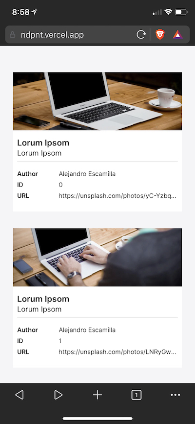

# Responsive Cards

Built with React, NextJS, and Styled Components.

Other tools used: Axios, ESLint and Prettier.

## Mobile



## Tablet


## Desktop


## Getting Started

1. Clone this repo and install dependencies with `npm install`.
2. Run development server

```bash
npm run dev
# or
yarn dev
```

3. Open [http://localhost:3000](http://localhost:3000) with your browser to see the result.
4. Run ESLint and Prettier with `npm run lint` if you want to check code integrity.

## Learn More

To learn more about Next.js, take a look at the following resources:

- [Next.js Documentation](https://nextjs.org/docs) - learn about Next.js features and API.
